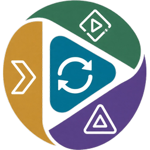

<p align="center">
  
</p>

# Watchsync

## WARNING

There is no `main` branch for a reason, things are still being tested and tweaked. My setup is Plex (main) to Emby (listener) as the backup. A couple other users are setup with Plex (main) and Jellyfin (listener). With that said there is not really any testing for Emby/Jellyfin (main) and Plex (listener) & i dont think there will be many situations like this as most who use Plex use it as their main source and only run backups for the numerous times their auth breaks and locks everyone out of their media (someone should teach them how to cache data for when this happens so it doesnt completely break everyone)...

Also it has not really been tested with something like Plex (main) and Emby (listener) and Jellyfin (listener), multiple listeners. In theory it shuold work as it is just a loop but feedback is always welcome if you try this.

## Purpose

Tool to keep users, libraries and watch history in sync across multiple media apps. Also used for disaster recovery on that history to populate a new database.

### Continous sync

Keep multiple media apps in sync with user, library & watch history so switching between them is seamless

### Disaster recovery

Database backups here can be used to restore a corrupted or broken media app database so all the watch history is restored

### Migrations

A one time use to copy over all libraries, users and watch history can be done to migrate from one app to another

### Information purposes

You can use the Library section to see how many movies/series are actually being watched and by which users

## Docker Compose

```yaml
services:
  watchsync:
    container_name: watchsync
    image: ghcr.io/notifiarr/watchsync:develop
    restart: unless-stopped
    ports:
      - 32399:80/tcp
    environment:
      - TZ=America/New_York
    volumes:
      - /home/watchsync/config:/config
```

## Setup

Initial login is admin:password, make sure you change it! Settings -> Login

Settings -> Login

- Update your login credentials

Media Apps

- Add you Plex, Emby & Jellfin instances (main required, listeneres needed for syncing)

Sync -> Parity

- Users tab: this section gives you checkboxes for which users you want to keep in sync. Check them and click `Save sync users` so future automation knows which users to sync. Manually link any existing users on the listeners by clicking their name in the main app and then the listeners. After that, trigger a sync and this will create the main media app users on the listeners
- Library tab: this is the same concept as the users tab and works the same way. Check the libraries you want to sync, link the ones that already exist, trigger a sync to create the ones that do not

Sync -> Library

- Same logic as the parity, check which libraries you want to keep in sync and hit save.
- This will populate the watchsync database with what each media app currently has. Since last or full scan will be the same outcome for the first time.

Sync -> History

- If you want to dry run what will change use that button and the log file will show you an overview when it is done, otherwise check the users and run the sync

## Media matching

Currently the paths from main are used to match with paths on the listeners. As long as all the apps have the same path access then it will have no problem matching data, creating libraries, etc

## Conflict resolution

The system looks at all media apps, finds which one has the newest timestamp & that is what is used. If one app has it marked as finished then all apps get set to finished, otherwise it takes the highest progress time and uses that.

## You want more sync features?

This app is built for a single purpose and that is not to solve every sync item and make perfect replicas of the apps, it does not match ratings for example or lists or favorites or any other "thing" that the media apps do. If you want something that does a lot more stuff with a more involved setup then I would recommend looking at some of the other sync apps out there as this is not your solution.

## License

This project is licensed under the MIT License.
